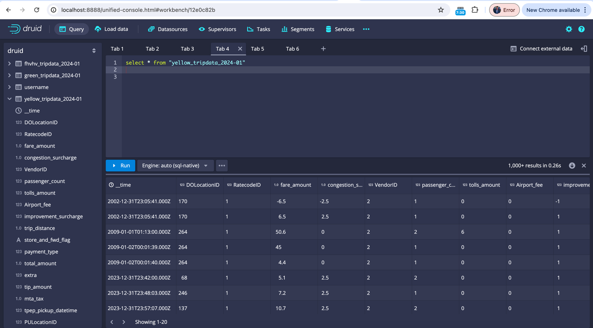

## Pt.1: Attempt these questions. You have to use SQL for the same, but you can try this with any database, data warehouse, lake house or query engine. Bonus points if you try on Apache Druid.
### To start Druid
```
docker-compose up
```

### Druid Console
```
 http://localhost:8888
```



### Payment Type Dynamics: Determine if there is a significant difference in the average tip amount for credit card payments compared to other payment types.
```
WITH credit_card_tips
     AS (SELECT Sum("tip_amount") AS tip_amount,
                Count(*)          AS total_trips
         FROM   "yellow_tripdata_2024-01"
         WHERE  "payment_type" = 1),
     other_payment_tips
     AS (SELECT Sum("tip_amount") AS tip_amount,
                Count(*)          AS total_trips
         FROM   "yellow_tripdata_2024-01"
         WHERE  "payment_type" != 1)
SELECT Round(credit_card_tips.tip_amount / credit_card_tips.total_trips, 2)
       AS
       avg_credit_card_tip,
       Round(other_payment_tips.tip_amount / other_payment_tips.total_trips, 2)
       AS
       avg_other_payment_tip,
       CASE
         WHEN Round(credit_card_tips.tip_amount / credit_card_tips.total_trips,
              2) >
              Round(
              other_payment_tips.tip_amount / other_payment_tips.total_trips, 2)
       THEN
         'Credit Card Tips Higher'
         WHEN Round(credit_card_tips.tip_amount / credit_card_tips.total_trips,
              2) <
              Round(
              other_payment_tips.tip_amount / other_payment_tips.total_trips, 2)
       THEN
         'Other Payment Tips Higher'
         ELSE 'No Significant Difference'
       END
       AS tip_difference_analysis
FROM   credit_card_tips,
       other_payment_tips 
```
### Ranking and Percentiles: Rank the top 10% of earnings based on the total earnings, considering both fare_amount and tip_amount.
### Dynamic Pricing Analysis: Calculate the average fare amount per mile for each RatecodeID, taking into account the day of the week and time of day.
```
WITH trip_info
     AS (SELECT ratecodeid,
                Time_extract(Millis_to_timestamp(tpep_pickup_datetime), 'DOW')
                AS
                   day_of_week,
                Time_extract(Millis_to_timestamp(tpep_pickup_datetime), 'HOUR')
                AS
                   hour_of_day,
                fare_amount,
                trip_distance
         FROM   "yellow_tripdata_2024-01"
         WHERE  trip_distance > 0)
SELECT ratecodeid,
       day_of_week,
       hour_of_day,
       Round(Sum(fare_amount) / Sum(trip_distance), 2) AS avg_fare_per_mile
FROM   trip_info
WHERE  ratecodeid > 0
GROUP  BY ratecodeid,
          day_of_week,
          hour_of_day
ORDER  BY ratecodeid,
          day_of_week,
          hour_of_day 
```
### Advanced Date and Time Analysis: Identify the top 5 busiest hours of the week in terms of total trips.
```
SELECT Time_format(Time_floor(__time, 'PT1H'), 'EEEE HH:00') AS hour_of_week,
       Count(*)                                              AS trip_count
FROM   "yellow_tripdata_2024-01"
GROUP  BY Time_floor(__time, 'PT1H')
ORDER  BY trip_count DESC
LIMIT  5 
```
### Geospatial Analysis: Find the shortest path (in terms of distance) between two given locations (PULocationID and DOLocationID) using the available trip data.
```
SELECT __time,
       pulocationid,
       dolocationid,
       trip_distance,
       fare_amount,
       total_amount
FROM   "yellow_tripdata_2024-01"
WHERE  pulocationid = 138
       AND dolocationid = 264
       AND trip_distance = (SELECT Min(trip_distance)
                            FROM   "yellow_tripdata_2024-01"
                            WHERE  pulocationid = 138
                                   AND dolocationid = 264
                                   AND trip_distance > 0)
LIMIT  1 
```


## Pt.2: Please read through the attached example.sql query and explain what's going on there in simple English.

<p>Analysis on video playback events from a Druid data source named "druid"."events_rollup_1hr_v2".</p>

Here's a point-by-point breakdown of the SQL query:

### Step 1: Virtual Table (`virtual_table`)
1. **Selection of Columns:**
    - The query selects a large number of columns from the `events_rollup_1hr_v2` table.

2. **Concatenation Logic:**
    - Creates a `title_season_episode` field by concatenating `title`, `season`, and `episode_name` with specific formatting.

3. **Conditional Fields:**
    - Defines new fields like `ad_ended_a`, `ad_error_a`, etc., which contain the `session_id` if `event_name` matches a specific value (otherwise `NULL`).

### Step 2: Outer Aggregation (`outer_agg`)
4. **Grouping:**
    - Groups the data by `player_name`, `player_version`, `platform`, `device_brand`, `proposition`, `os`, and `device_category`.

5. **HyperLogLog Functions:**
    - Uses `DS_HLL` to estimate the distinct count of session IDs for different event types (e.g., `DS_HLL(attempts_a)`).

6. **SUM Aggregations:**
    - Performs sum aggregations on metrics like `vst_sum`, `vst_count`, `hb_cirt_sum`, `hb_buffering_time_sum`, and others.

### Step 3: Final Selection and Calculation
7. **Player Name Transformation:**
    - Applies `CASE` statements to transform the `player_name` based on combinations of `proposition`, `player_name`, `platform`, `os`, and `device_category`.

8. **Metric Calculations:**
    - Calculates various metrics:
        - `Attempts`, `EBVS`, `Plays`, `VSF`, `VPF` using distinct counts of their respective HLL fields.
        - `Ended Plays` as the count of `session_ended_a` minus counts of `exit_before_video_start_a` and `video_start_failure_a`.
        - `VST (s)` as the average video start time.
        - `EBVS`, `VPF-T`, `VSF-T` as ratios of specific event counts to `Attempts` or `Ended Plays`.
        - `CIRR` as the Content Initiation Rate Ratio (sum of `hb_cirt_sum` divided by the sum of `hb_buffering_time_sum` and `hb_playing_length_sum`).

9. **Ordering and Limiting:**
    - Orders results by `Attempts` in descending order.
    - Limits the result set to the top 50 records.